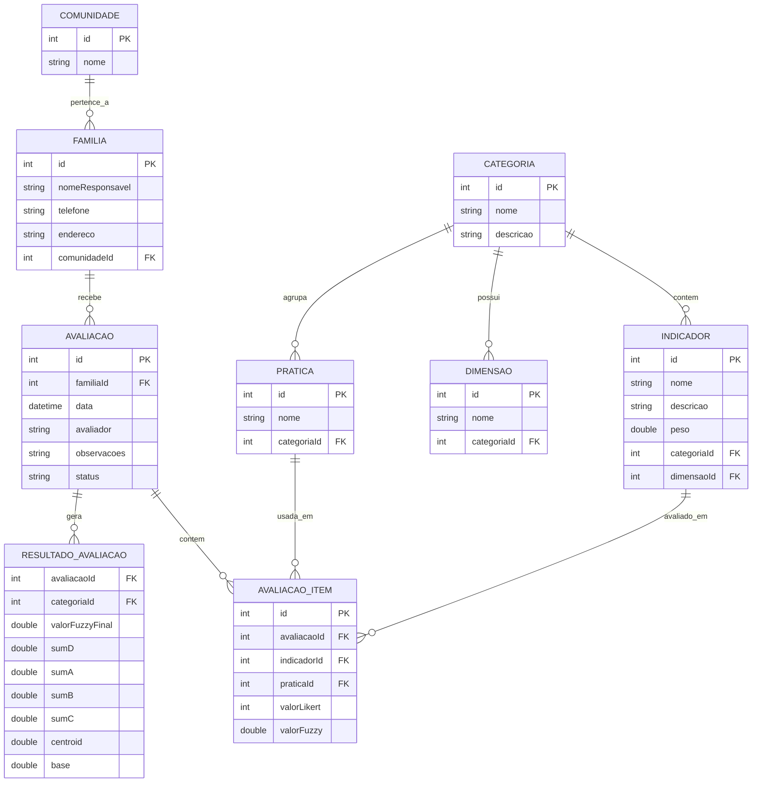

# Modelagem de dados do projeto

Diagrama baseado nas entidades do domínio e nas tabelas do banco de dados do projeto.

Observações:
- `FuzzyNumber` é um objeto de cálculo auxiliar, não uma entidade persistida;
- os valores fuzzy são armazenados nos itens de avaliação e nos resultados finais.
